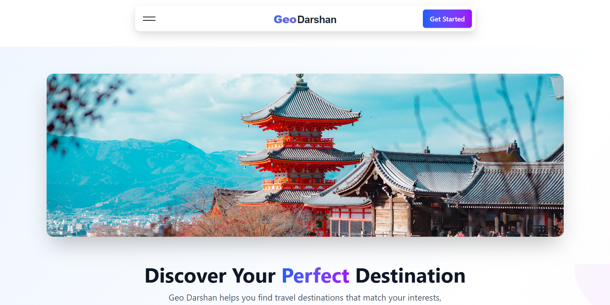
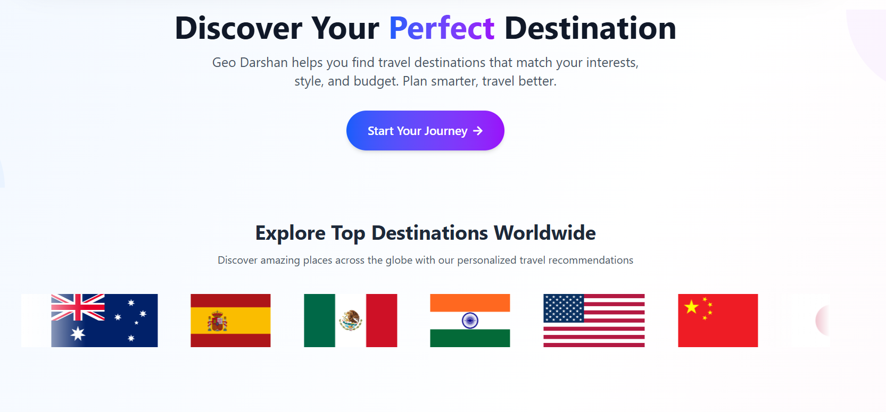
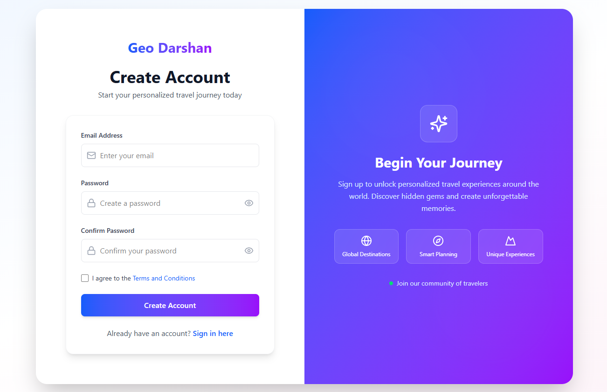
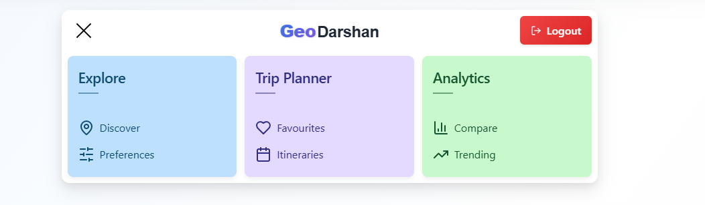
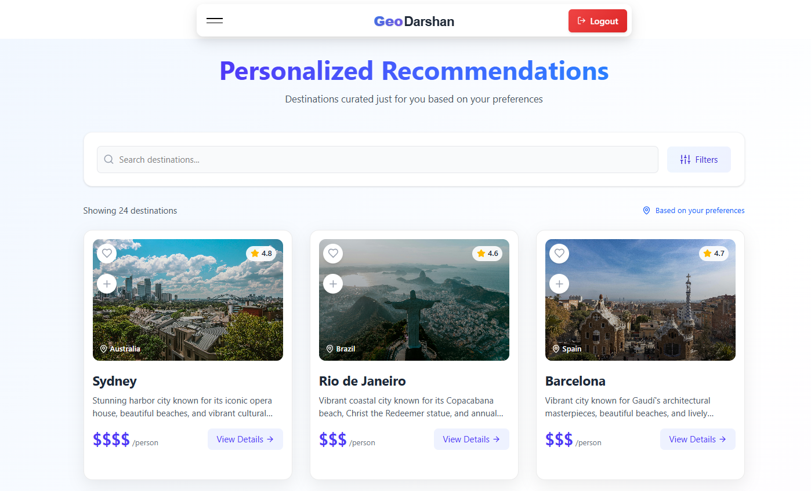
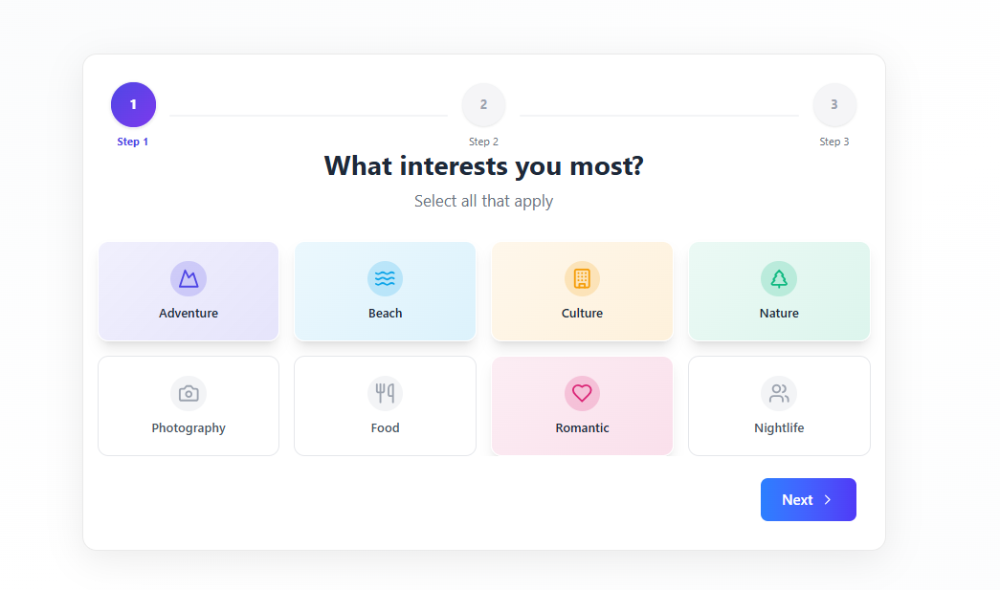
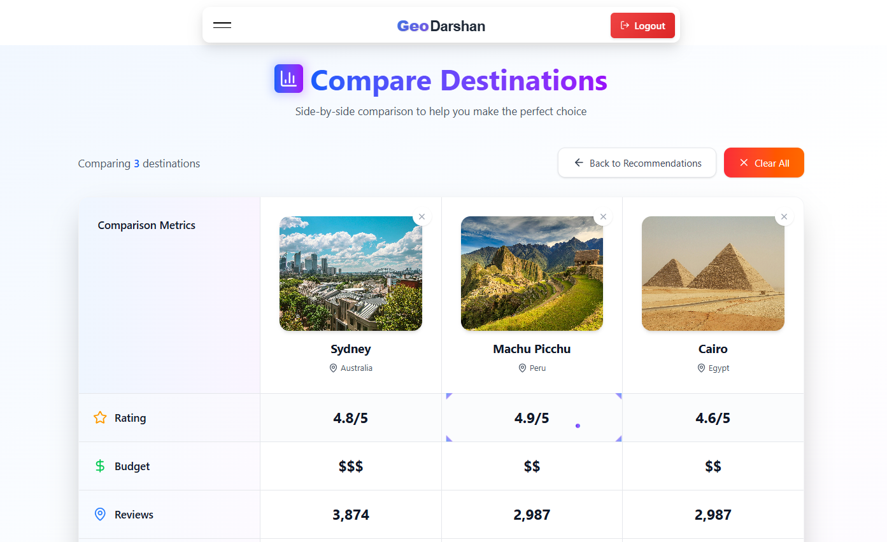
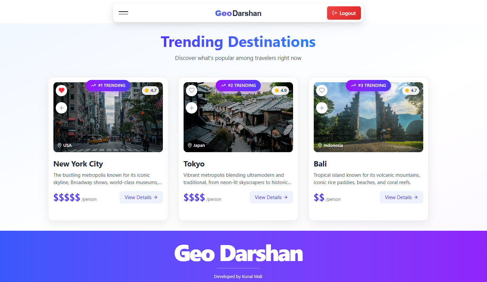

# Geo Darshan: Personalized Destination Recommendation Platform

## ✈️ Introduction

Geo Darshan is a personalized travel recommendation platform that helps users discover ideal destinations based on preferences like interests, budget, travel style, and more. With the plethora of travel destinations available, choosing the right place can be overwhelming. Our platform simplifies this by providing tailored suggestions, enhancing travel planning and discovery.

**Travel smarter and better with Geo Darshan!** ✈️🧳🌏

## 🚀 Live Demo

**Frontend Live Demo:** 👉 https://geodarshan-bykunal.netlify.app

## 🖼️ UI

## ✨ Core Features

- **🔐 User Authentication** - Secure login/registration with Firebase Auth
- **🧠 Smart Recommendations** - Based on interests, budget & activities
- **🗺️ Interactive Map View** - Explore destinations using Leaflet
- **⭐ Favorites Management** - Save favorite destinations per user
- **📌 Itinerary Builder** - Plan and manage your travel schedule

## 🚀 Unique Features

- **➕ Compare Destinations** - Side-by-side comparison of up to 3 destinations
- **🔥 Trending Destinations** - Discover popular spots based on user activity

## 🎨 Additional Features

- **🔍 Search, Filters & Pagination**
- **💬 User Reviews Section**
- **📱 Fully Responsive Design** - Works on desktop, tablet & mobile

## 🧪 Technology Stack

**Frontend:**

- React.js (with Vite)
- React Router for navigation
- Redux Toolkit for state management

**Database:**

- Firebase Authentication
- Firebase Firestore

**Maps:**

- Leaflet
